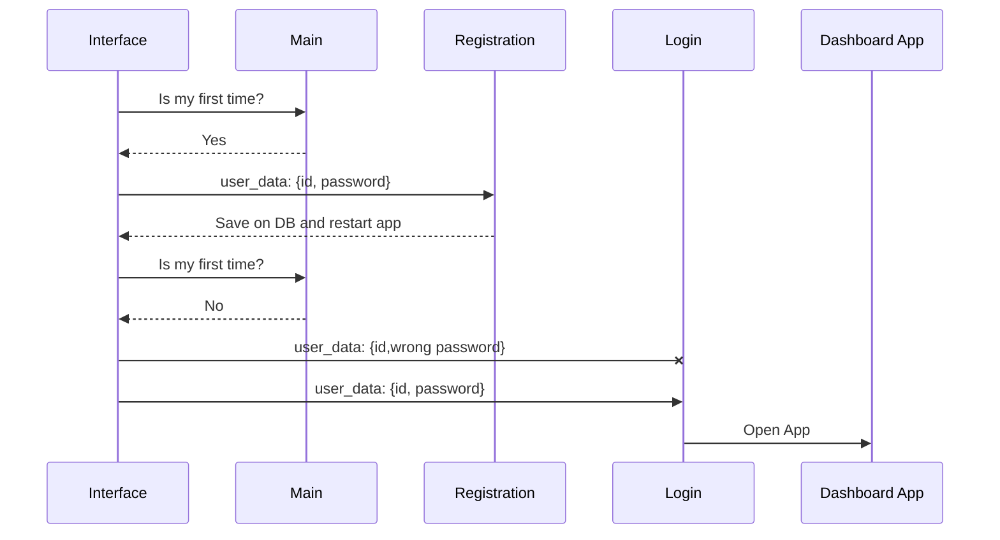

# 🌐 Network Manager System

Sistema de gerenciamento de rede desenvolvido utilizando **JavaScript** (Node.JS e Electron.JS) para a Interface e gerenciamento de usuário e **Python** com scripts para comunicação com a placa de rede e obtenção de dados da rede.

## Estrutura do Repositório

```
.
├── interface
│   ├── assets/
│   ├── db/
│   ├── modules/
│   ├── *.html
│   └── *.js
├── network_scan.py
├── wifi_password.py
├── requirements.txt
├── .gitignore
└── README.md
```

## Configuração

`interface/*` - Pasta destinada ao código da interface e fluxo de login

`interface/db/` - Diretório de armazenamento dos arquivos de banco de dados

`interface/assets/*` - Contém arquivos da estilização do programa (Front da aplicação)

`interface/modules/` - Códigos referente ao core da comunicação do projeto (Node.JS)

`network_scan.py` - Script responsável pelo escaneamento da rede para descoberta de dispositivos

`wifi_password.py` - Script responsável pela obtenção dos dados de conexão de Wifis conhecidos

`requirements.txt` - Arquivo contendo os requisitos de instalação do Python para o projeto

# Funcionalidades

O princípio do projeto é ter uma autenticação funcional para o administrador e funcionalidades para auxiliar no controle da rede.

## Diagrama do primeiro fluxo

A lógica desse fluxo é feita em **JavaScript** (Node.JS)



## Funcionalidades do primeiro fluxo:

 - Verificação se é a primeira vez usando o app
-- É realizada uma leitura no arquivo *.db/.sqlite* para verificar se possui algum registro de usuário. Caso não, é exibida a tela de **Registro**, caso sim, é direcionado a tela de **Login**

> Todas as senhas são armazenas em Hash para melhor segurança.


 - Exibição de erros
-- Caso sejam enviados dados inválidos ou incompatíveis com o Login criado anteriormente, é exibida uma mensagem de erro para o usuário

## Funcionalidades do Dashboard:
 - [x] Varredura na rede para descobrir quais dispositivos estão conectados;
 -- Depois da varredura, é exibida uma tabela com **IP**, Endereço **MAC** e o **Nome do Dispositvo** identificado pelo roteador.
 

 - [x] Design Amigável;
	

 - [x] Loading para simbolizar carregamento e melhor a experiência do usuário;


 - [x] Busca de Wifis conhecidos e suas senhas;


 - [x] Opção de deletar os dados fornecidos de acordo com os requisitos da **LGPD**;


## :hammer: Tecnologias

Este projeto foi desenvolvido com as seguintes tecnologias:

- [JavaScript](https://www.javascript.com)
- [Node.JS](https://nodejs.org/en/)
- [Electron.JS](https://www.electronjs.org)
- [Python](https://www.python.org)
- [SQLite](https://www.sqlite.org/index.html)
- [Visual Studio Code](https://code.visualstudio.com)
- [Pycharm](https://www.jetbrains.com/pt-br/pycharm/)

## :books: Requisitos
- Estar em um sistema  [**Windows**](https://www.microsoft.com/pt-br/software-download/) para melhor funcionamento do programa.
- Ter [**Git**](https://git-scm.com/) para clonar o projeto.
- Ter [**Python**](https://www.python.org) instalado.
- Ter [**Node.JS**](https://nodejs.org/en/) instalado.
- Ter [**Npcap**](https://npcap.com) de driver instalado para comunicação com a placa de rede.
- Ter [**Microsoft Visual C++ 14.0 ou mais recentes**](https://visualstudio.microsoft.com/pt-br/visual-cpp-build-tools/) instalado para o funcionamento do netifaces do Python.

## :gear: Iniciando a interface
```bash
  # Iniciar a aplicação:
  $ pip install -r requirements.txt  
  $ cd Interface
  $ npm install
  $ npm start
```
